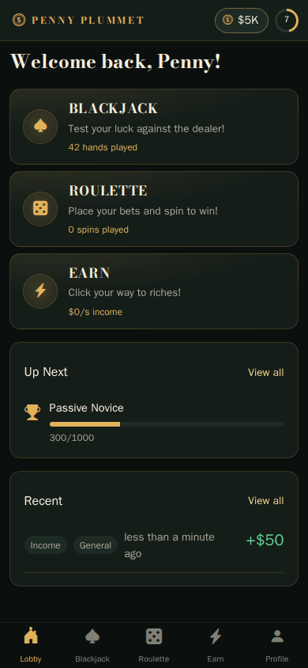
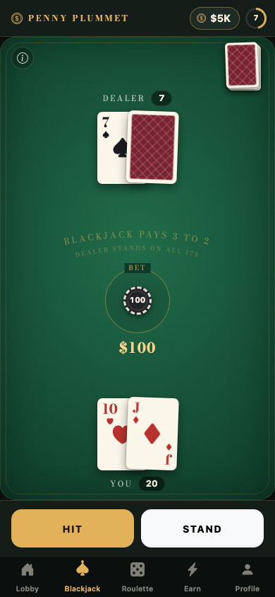
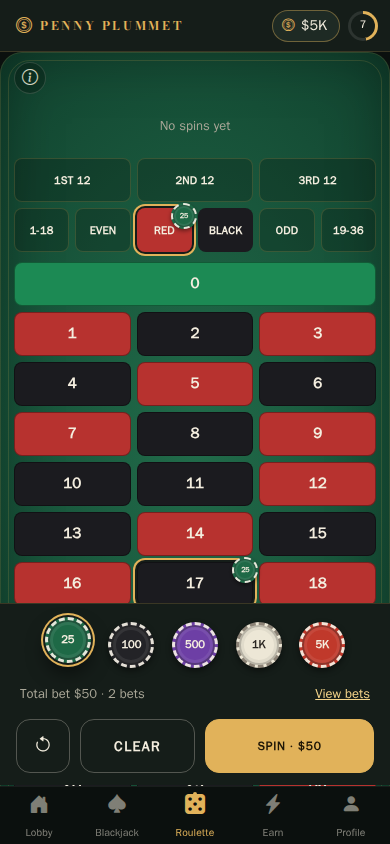
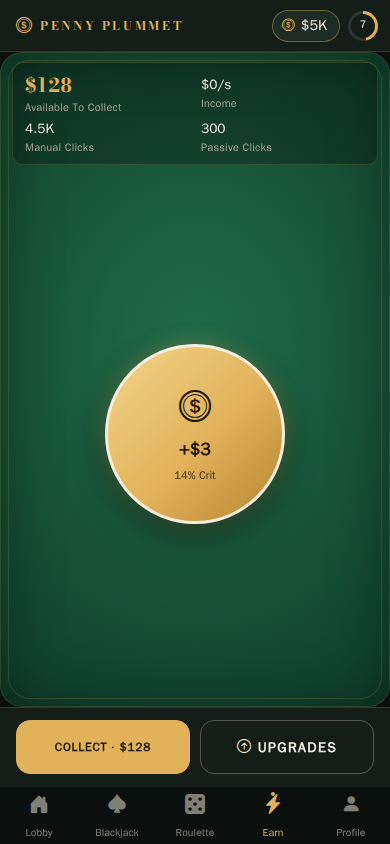

<div align="center">
  
  <h1>Penny Plummet</h1>
  <p>
    <strong>A mobile-first casino game for the browser.</strong><br />
    Play blackjack, spin European roulette and build a passive income, all with pretend chips.
  </p>
  <p>
    <a href="https://penny-plummet.bence.im"><strong>▶ Play it at penny-plummet.bence.im</strong></a>
  </p>
  <p>
    <a href="https://github.com/benceb2/penny-plummet/actions/workflows/ci.yml"></a>
    <a href="LICENSE"></a>
  </p>
</div>

<!-- These are the Playwright screenshot baselines, so they always show the current UI. -->
<p align="center">
  
  
  
  
</p>

Penny Plummet is a single-page app with no backend and no accounts. Everything, from your chip balance to your transaction history, lives in your browser, and there is nothing to buy: the chips are make-believe and there is no real-money gambling.

## What's inside

### Games

- **Blackjack.** Bet with chips from the tray, then hit or stand against the dealer. Common casino rules: natural blackjack pays 3:2, the dealer stands on all 17s, ties push. Rules and payouts sit behind the info button.
- **Roulette.** European single-zero table. Stack chips on straight numbers, dozens or the even-money outside bets, undo or clear before you spin, and follow the recent winning numbers along the top.
- **Earn.** An idle game that keeps the chips coming: tap for income, land critical hits, buy auto-clickers, multipliers and speed upgrades, and collect what accrued while you were away.

### Progression

- Level up by earning XP; each level pays out a chip reward.
- 34 achievements across the three games and general play, each with chip and XP rewards.
- A full transaction history (filterable by game and type) and lifetime statistics on your profile.
- Toasts for level-ups and unlocked achievements.

### The rest

- Mobile-first shell: persistent HUD with balance and level, bottom tab bar, and a fixed action tray on game screens. Works just as well on desktop.
- Installable as a PWA with the dark casino theme carried through to the splash screen and status bar.
- English and Hungarian, switchable in Settings.
- Save management: export your progress to a file, import it on another device, or wipe it and start again.
- Accessible by default: every screen is checked with axe, and animations respect `prefers-reduced-motion`.

## Tech stack

| Area | Choice |
| --- | --- |
| Framework | [Vue 3](https://vuejs.org/) (Composition API) with [TypeScript](https://www.typescriptlang.org/) |
| Tooling | [Vite](https://vite.dev/), [vite-plugin-pwa](https://vite-pwa-org.netlify.app/) (Workbox) |
| State | [Pinia](https://pinia.vuejs.org/) with [pinia-plugin-persistedstate](https://prazdevs.github.io/pinia-plugin-persistedstate/); transactions in IndexedDB |
| Routing and i18n | [Vue Router](https://router.vuejs.org/), [Vue I18n](https://vue-i18n.intlify.dev/) |
| UI | [Bootstrap 5](https://getbootstrap.com/), [Bootstrap Icons](https://icons.getbootstrap.com/), [Bodoni Moda](https://fonts.google.com/specimen/Bodoni+Moda) |
| Testing | [Vitest](https://vitest.dev/), [Playwright](https://playwright.dev/) with [axe-core](https://github.com/dequelabs/axe-core) for accessibility, Playwright screenshot comparison for visual regressions |
| Hosting | [Vercel](https://vercel.com/) |

## Getting started

Requires Node 20 (see `.nvmrc`; run `nvm use` if you have nvm).

```sh
npm install
npm run dev
```

The dev server runs Vite alongside ESLint in watch mode. To build and preview a production bundle:

```sh
npm run build
npm run preview
```

## Testing and checks

| Command | What it runs |
| --- | --- |
| `npm test` | Vitest unit and component tests |
| `npm run test:a11y` | Playwright accessibility (axe) and viewport-fit tests in Chromium |
| `npm run test:screenshots` | Visual regression against the baselines in `tests/screenshots/__screenshots__` (needs Docker) |
| `npm run type-check` | `vue-tsc` |
| `npm run lint` | ESLint (with `--fix`) |

Screenshot tests run inside the official Playwright container so that fonts and rendering match CI; a bare `npx playwright test` on macOS will report every screenshot as changed. Use `npm run test:screenshots:update` to accept new baselines after reviewing the diff.

Playwright needs its browsers installed once before the a11y tests: `npx playwright install --with-deps chromium`.

## Project structure

```
src/
  components/   app shell (HUD, tab bar, toasts), game primitives (chips, tray, result banner, rules sheet), modals
  composables/  animated numbers, pagination, IndexedDB support check
  locales/      en and hu message files, one per feature
  stores/       Pinia stores: one per game, plus user, achievements, transactions and toasts
  utils/        pure game logic and helpers (deck handling, payouts, save serialisation)
  views/        one folder per route
tests/
  a11y/         axe checks for every screen and modal
  layout/       viewport-fit checks at phone sizes
  screenshots/  visual regression specs and per-device baselines
```

## Contributing

Issues and pull requests are welcome. See [CONTRIBUTING.md](CONTRIBUTING.md) for the local setup, conventions and the checks to run before opening a PR.

## Licence

[MIT](LICENSE)
