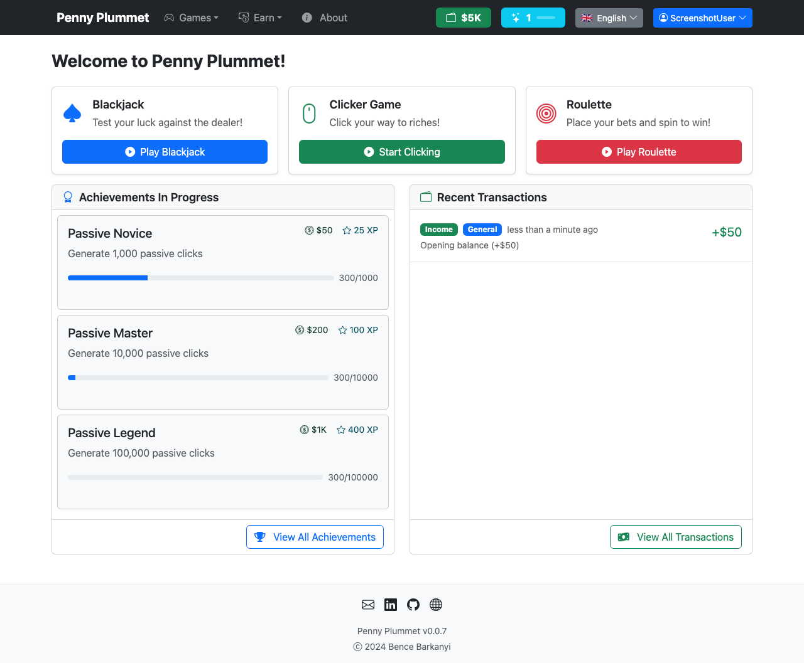

#  Penny Plummet

Penny Plummet is a browser-based casino gaming PWA where you start with 50 chips and try to build a fortune. It features Blackjack, Roulette, and an idle Clicker game, along with an achievement system, player stats, and offline earnings. Everything runs entirely in the browser — no account, no server, no data sent anywhere.

**Live demo:** [https://penny-plummet.vercel.app](https://penny-plummet.vercel.app)



## Tech stack

| Layer | Library |
|---|---|
| Framework | [Vue 3](https://vuejs.org/) (Composition API) |
| Language | [TypeScript](https://www.typescriptlang.org/) |
| Build | [Vite](https://vitejs.dev/) |
| State | [Pinia](https://pinia.vuejs.org/) + [pinia-plugin-persistedstate](https://prazdevs.github.io/pinia-plugin-persistedstate/) |
| UI | [Bootstrap 5](https://getbootstrap.com/) + [Bootstrap Icons](https://icons.getbootstrap.com/) |
| PWA | [vite-plugin-pwa](https://vite-pwa-org.netlify.app/) |
| i18n | [vue-i18n](https://vue-i18n.intlify.dev/) |
| Testing | [Vitest](https://vitest.dev/), [Playwright](https://playwright.dev/), [@axe-core/playwright](https://github.com/dequelabs/axe-core-npm) |

## Local storage

All game data (chips, stats, achievements, settings) is persisted in `localStorage` and `IndexedDB`. Nothing leaves your browser.

## Dev setup

```sh
npm install
npm run dev
```

## Available scripts

| Script | Description |
|---|---|
| `npm run dev` | Start dev server with hot reload |
| `npm run build` | Type-check + production build |
| `npm run preview` | Preview production build locally |
| `npm run type-check` | Run `vue-tsc` |
| `npm test` | Unit tests (Vitest) |
| `npm run test:a11y` | Accessibility tests (Playwright + axe-core) |
| `npm run test:screenshots` | Screenshot regression tests |
| `npm run test:screenshots:update` | Update screenshot baselines |
| `npm run generate-icons` | Regenerate PWA icons from `public/favicon.svg` |
| `npm run lint` | Lint and auto-fix with ESLint |

## License

MIT — see [LICENSE](./LICENSE).
